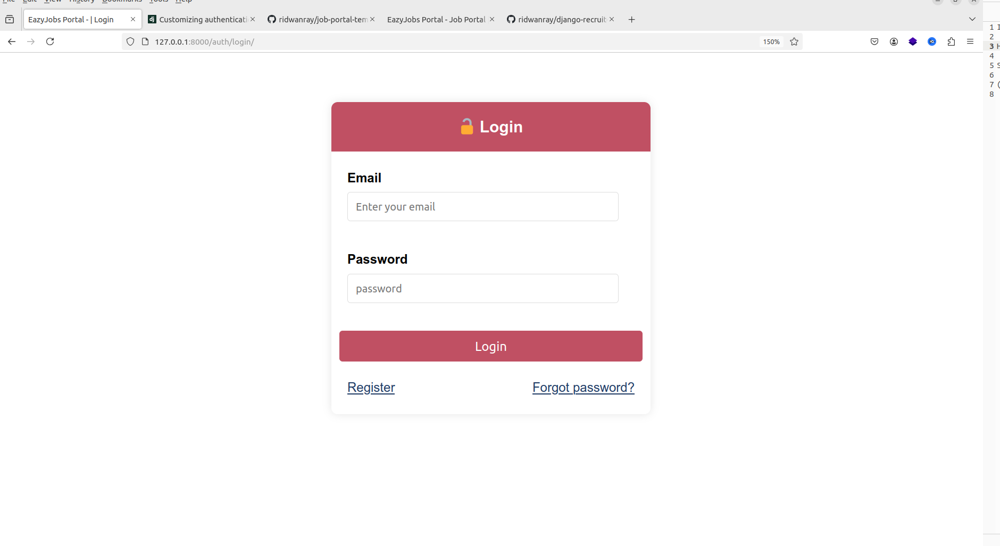
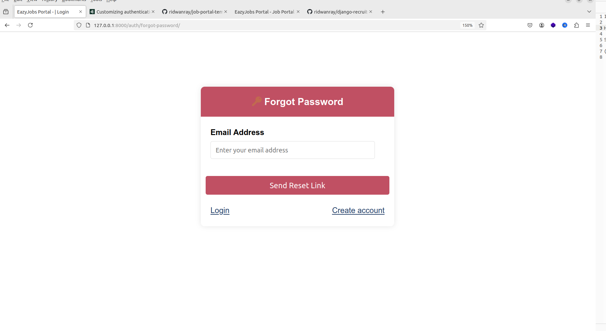
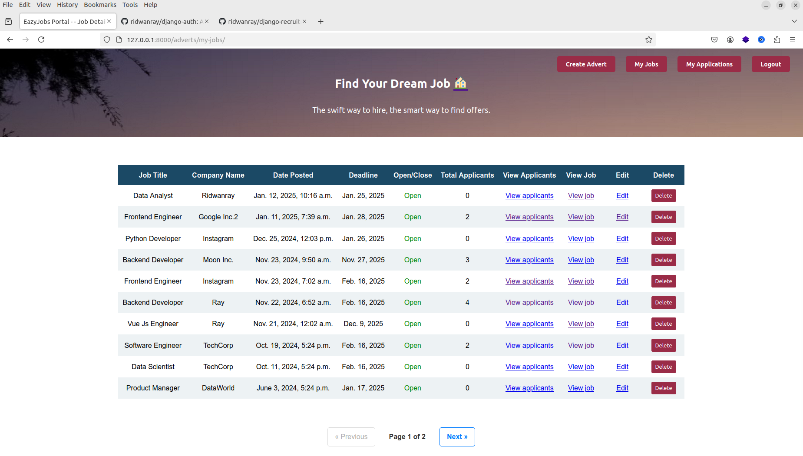
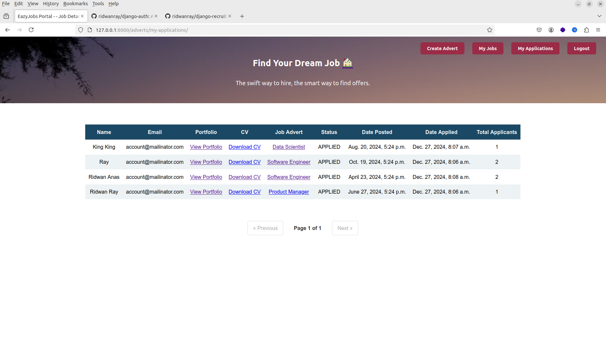
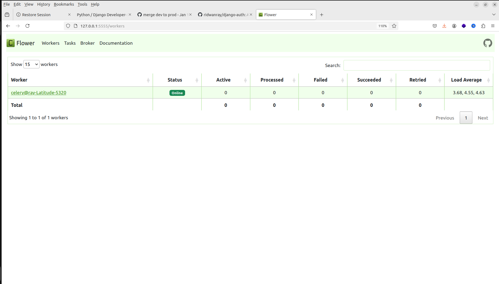

# Django Job Portal
A Recruitment project built with Django


# Tools & Services:
- Django : Python Web Framework
  


# Features

- Login
- Register
- Account verification
- Password reset
- Sending email
- Create/Update/Delete/List Job Adverts
- Apply to Jobs
- Track your applications and jobs
- Reject & Interview candidates
- Email notifications

# Running locally

Create a .env file by copying the .env.sample provided and run:


# Running In a VirtualEnv

Create a virtual environment using:
```
python3 -m venv venv
```

```
pip install -r requirements.txt
```

```
python manage.py makemigrations
py
python manage.py migrate
```

Run the server using:
```
python manage.py runserver
```


# Login



# Register


# Verify Account



# Reset password


# Home


# My Jobs


# My Applications



# Dashboard


